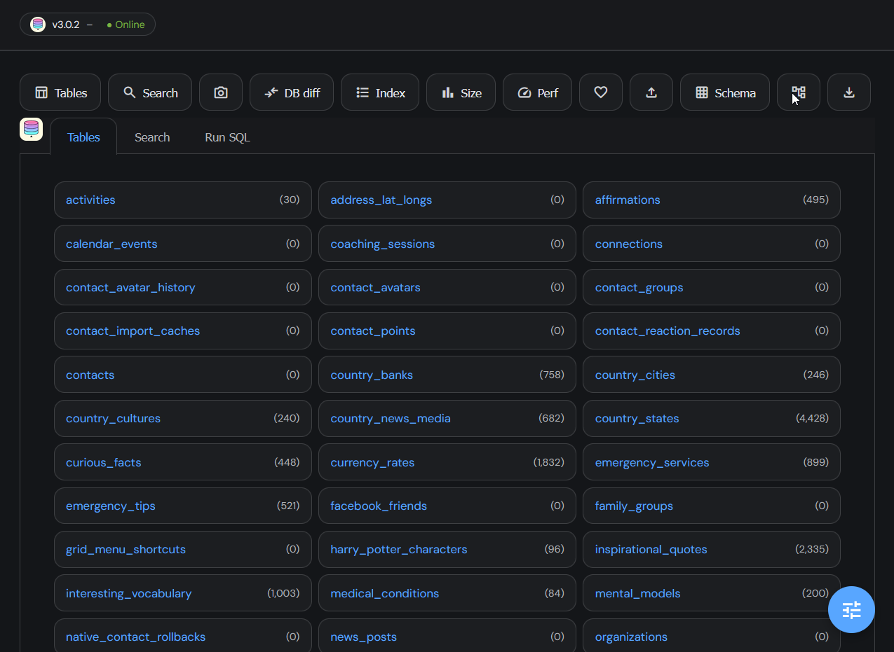
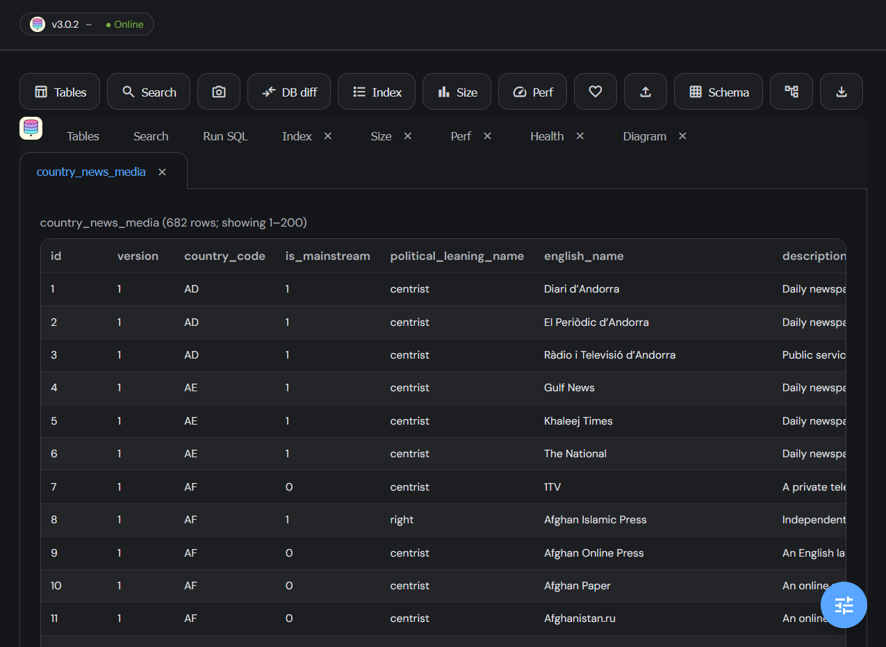
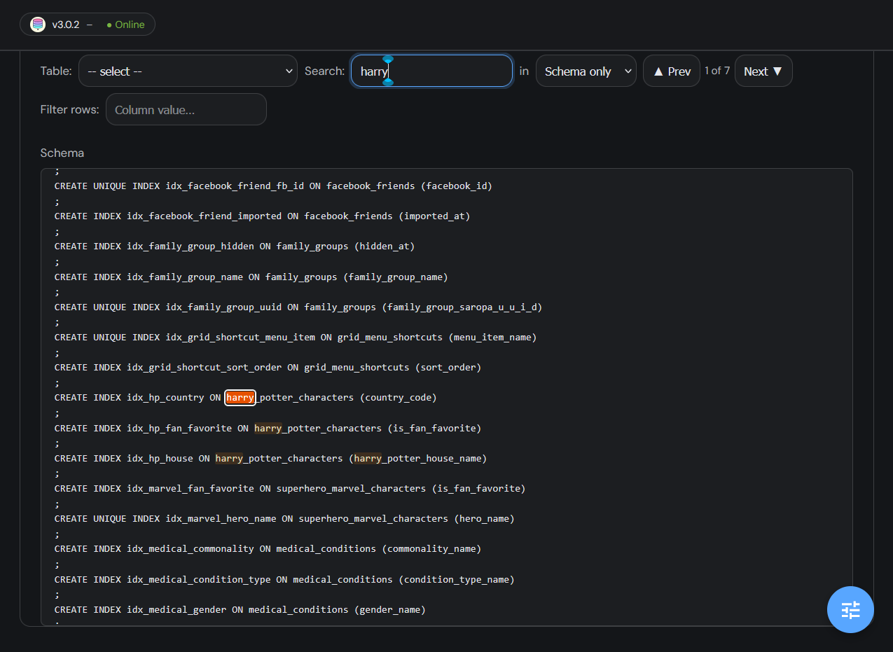
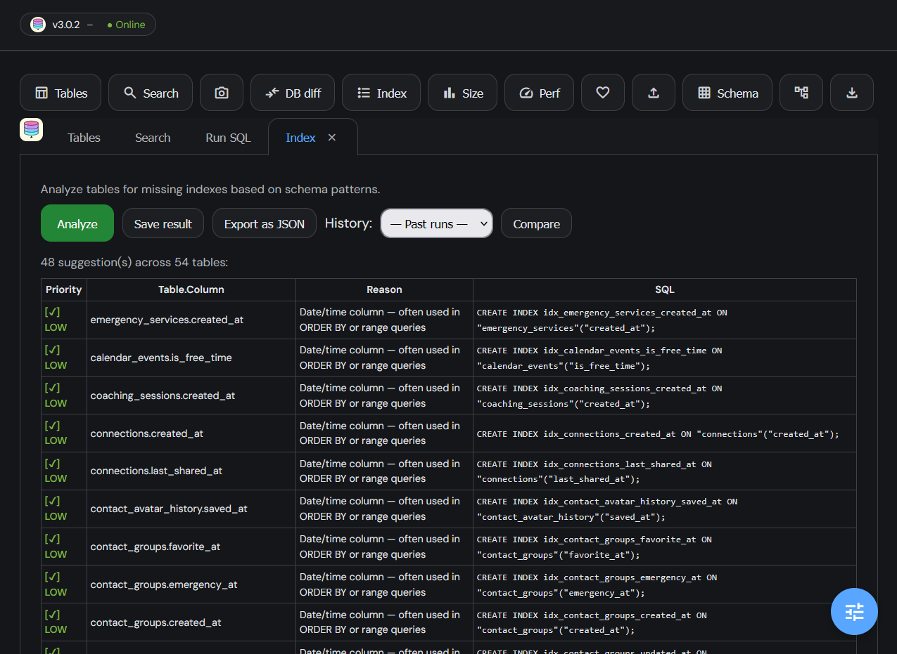
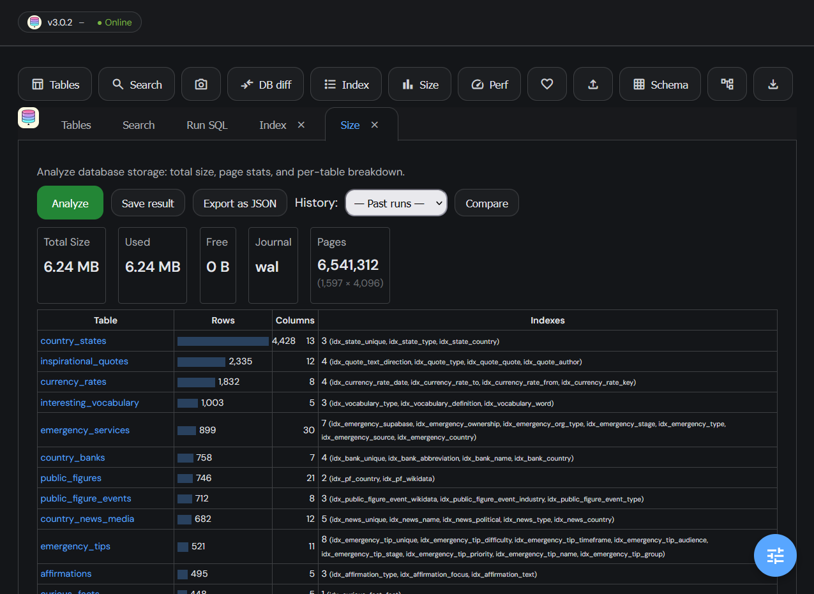
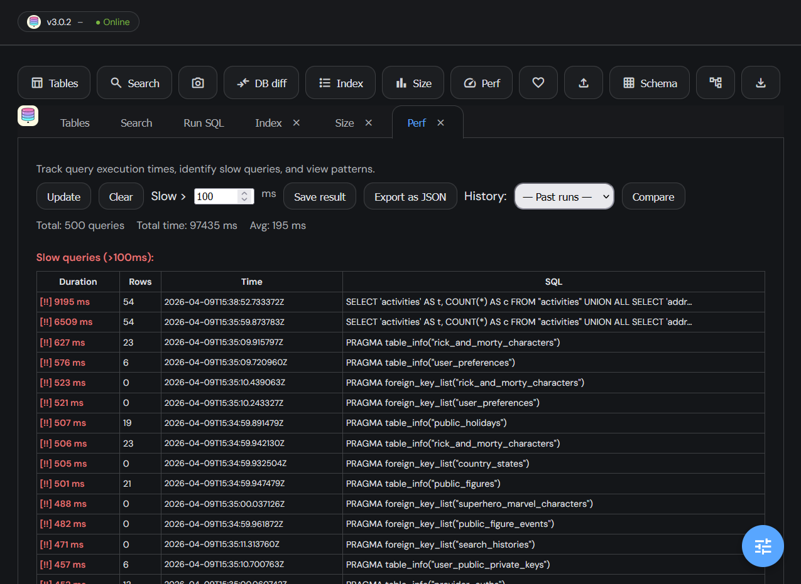
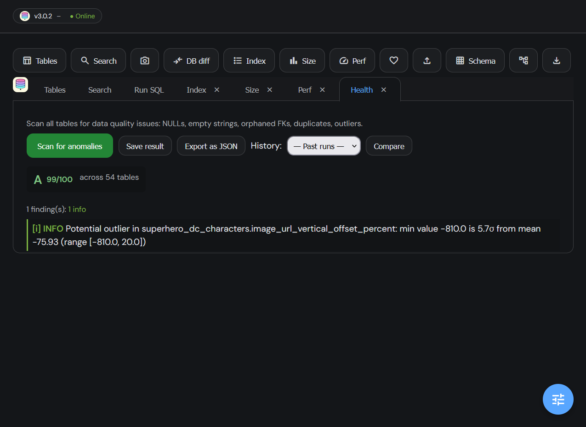
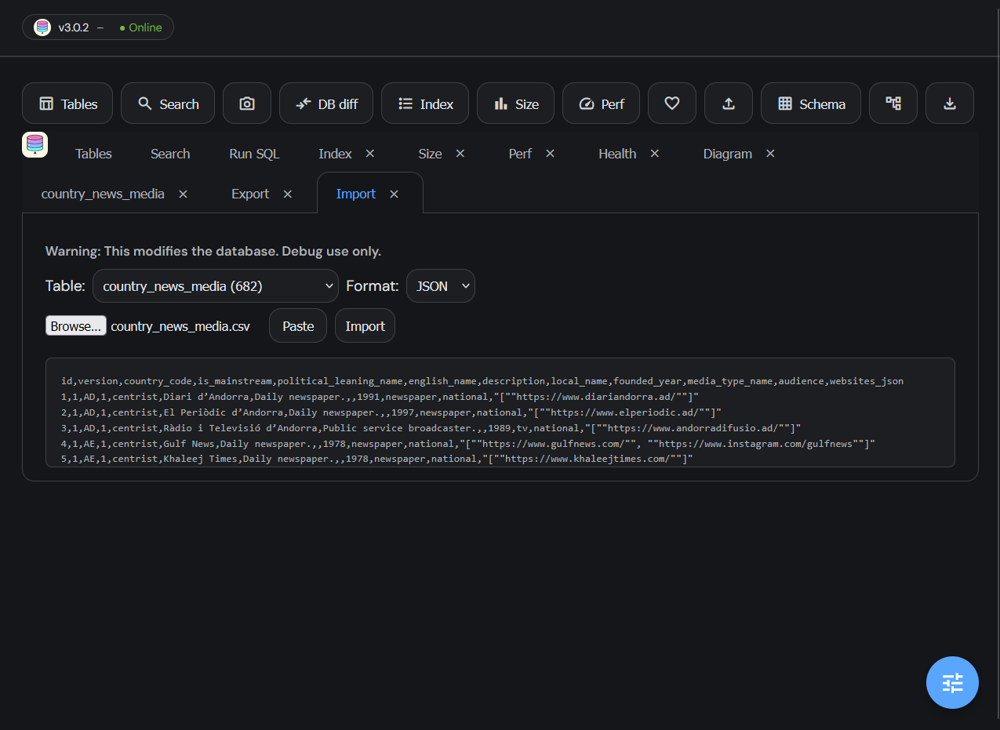
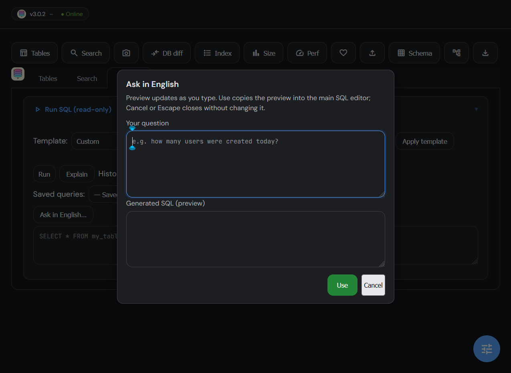
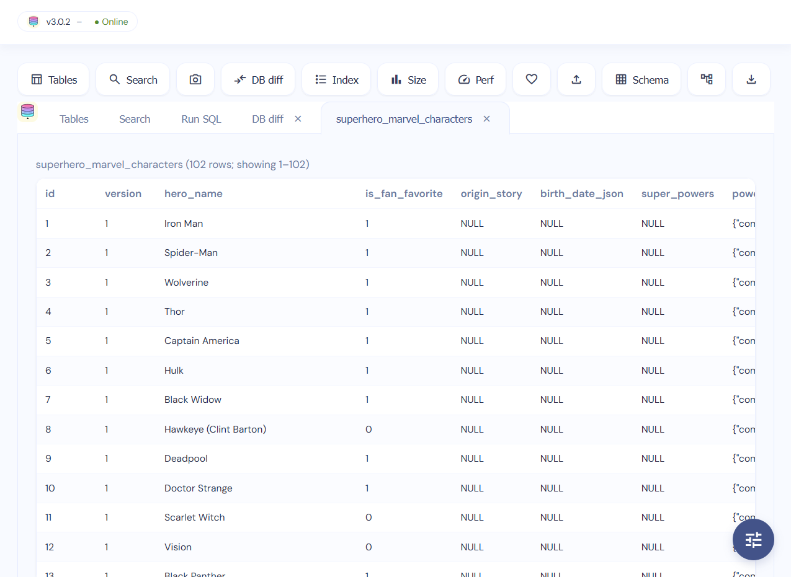

# Saropa Drift Advisor

[](https://pub.dev/packages/saropa_drift_advisor)
[](https://marketplace.visualstudio.com/items?itemName=saropa.drift-viewer)
[](https://open-vsx.org/extension/saropa/drift-viewer)
[](https://github.com/saropa/saropa_drift_advisor/actions/workflows/main.yaml)
[](https://opensource.org/licenses/MIT)

**Saropa Drift Advisor** is a **debug-only** toolkit for SQLite and [Drift](https://drift.simonbinder.eu/) in Flutter and Dart. Your app hosts a small **HTTP debug server**; you inspect the same database through a **full browser UI** or the **VS Code / Cursor extension**—same REST API, same live data. Beyond browsing: SQL notebooks and EXPLAIN trees, ER diagrams and schema diff, migration preview and rollback codegen, anomaly and index tooling, optional imports/edits with **batch apply**, **VM Service** integration while debugging, merged **`/api/issues`** for linters, pre-launch health tasks, portable HTML reports, and shareable **session URLs**. None of it ships in release builds if you gate on `kDebugMode`. For a **single table** that maps every major capability, see **[Scope at a glance](#scope-at-a-glance)** under [Features](#features).

|                               |                                                                                                                                                                                                                          |
| ----------------------------- | ------------------------------------------------------------------------------------------------------------------------------------------------------------------------------------------------------------------------ |
| **One dependency in the app** | Start the server behind `kDebugMode`; the Dart package has **zero third-party runtime dependencies**.                                                                                                                    |
| **Two clients**               | Open **`http://127.0.0.1:8642`** from any browser, or use the extension for tree views, SQL notebooks, and navigation into your Drift source.                                                                            |
| **Built for real workflows**  | Optional **Bearer / Basic auth** for tunnels, **rate limits**, **import/export**, **portable HTML reports**, and IDE features that understand your `Table` classes—including **offline** schema scan from `.dart` files. |

### Install at a glance

| What                       | Where                                                                                                                                                                                                                                                               |
| -------------------------- | ------------------------------------------------------------------------------------------------------------------------------------------------------------------------------------------------------------------------------------------------------------------- |
| **Dart / Flutter package** | [`saropa_drift_advisor` on pub.dev](https://pub.dev/packages/saropa_drift_advisor) — add to `pubspec.yaml`, call `startDriftViewer` or `DriftDebugServer.start` (see [Quick start](#quick-start)).                                                                  |
| **VS Code / Cursor**       | [Visual Studio Marketplace](https://marketplace.visualstudio.com/items?itemName=saropa.drift-viewer) · [Open VSX](https://open-vsx.org/extension/saropa/drift-viewer) — Marketplace id `saropa.drift-viewer` ([why that id?](#vs-code-extension-separate-install)). |
| **REST API**               | [doc/API.md](doc/API.md) — endpoints, schemas, errors, examples (for custom tools or automation).                                                                                                                                                                   |

### Why teams use it

- **See the DB your app actually has** — Emulator, device, or desktop: one URL or one sidebar instead of juggling `sqlite3` and file paths.
- **Keep code and schema honest** — Schema diff, linter-style hints, migration preview/rollback helpers, **scan Drift definitions from Dart** with no running app, and a merged **`GET /api/issues`** surface for tools like Saropa Lints.
- **Debug without drowning in logs** — Mutation stream, snapshots, compare-to-current, row-level navigation along foreign keys.
- **Share safely** — Mask PII in the viewer, optional auth on the wire, and time-boxed collaborative sessions for QA or reviews.

### Screenshots

<table>
<tr>
<td width="50%">
<strong>Tables</strong> — grid overview of all tables with row counts<br>

</td>
<td width="50%">
<strong>Table Data</strong> — browse rows with pagination, FK navigation, and cell copy<br>

</td>
</tr>
<tr>
<td>
<strong>Schema</strong> — CREATE statements with SQL syntax highlighting<br>

</td>
<td>
<strong>Index</strong> — missing-index suggestions with priority and ready-to-use SQL<br>

</td>
</tr>
<tr>
<td>
<strong>Size</strong> — storage breakdown by table, indexes, and journal mode<br>

</td>
<td>
<strong>Perf</strong> — query execution times, slow-query detection, and patterns<br>

</td>
</tr>
<tr>
<td>
<strong>Health</strong> — anomaly scan for NULLs, orphaned FKs, outliers<br>

</td>
<td>
<strong>Import</strong> — CSV/JSON/SQL import with column mapping<br>

</td>
</tr>
<tr>
<td>
<strong>Ask in English</strong> — natural language to SQL with live preview<br>

</td>
<td>
<strong>Light Mode</strong> — one of four themes (Light, Showcase, Dark, Midnight)<br>

</td>
</tr>
</table>

### Contents

- [Screenshots](#screenshots)
- [How it works](#how-it-works)
- [Features](#features)
  - [Scope at a glance](#scope-at-a-glance)
  - [HTTP debug server (core)](#http-debug-server-core)
  - [VS Code extension](#vs-code-extension-separate-install)
- [Quick start](#quick-start)
- [API summary](#api-summary)
- [Security](#security)
- [Documentation and resources](#documentation-and-resources)
- [Development](#development)
- [Publishing](#publishing)

> **README ↔ changelog:** This file was last revised to match **[CHANGELOG.md](CHANGELOG.md) version 2.10.0**. For the full version history and older releases, see the changelog and [CHANGELOG_ARCHIVE.md](CHANGELOG_ARCHIVE.md).

---

## How it works

Your app runs a lightweight debug server that exposes database tables over HTTP. **`DriftDebugServer`** (or **`startDriftViewer`**) binds to a port (default **8642**), runs **only when you enable it** (typically `kDebugMode`), and serves JSON plus the bundled **web viewer** assets. Any client that can reach that host/port—**a browser tab**, the **VS Code extension**, or your own scripts using **[doc/API.md](doc/API.md)**—talks to the **same** live database through the same API.

You usually inspect data in either a **browser** or the **extension**; both are first-class.

|                | Browser                      | VS Code Extension          |
| -------------- | ---------------------------- | -------------------------- |
| **Install**    | None — open `localhost:8642` | Install from Marketplace   |
| **Works with** | Any editor, CI, QA, mobile   | VS Code / Cursor           |
| **Best for**   | Quick look, sharing URLs     | Daily development workflow |

---

## Features

The subsections below are the **full feature inventory** (browser UI, REST API, and extension). If you only read one part of this README, read this: the project is not “a table viewer”—it is a **debug platform** for Drift/SQLite.

<a id="scope-at-a-glance"></a>

### Scope at a glance

| Job to be done               | What you use                                                                                                                                                                                                                                                                                                                   |
| ---------------------------- | ------------------------------------------------------------------------------------------------------------------------------------------------------------------------------------------------------------------------------------------------------------------------------------------------------------------------------ |
| **Browse & search**          | Multi-table tabs, collapsible sidebar (header **Sidebar** can hide the whole left column for full-width content), pinned tables, row filters, match navigation, FK breadcrumbs, human-readable types, NULL display, cell copy / full-value popup, optional **PII masking**.                                                    |
| **Query**                    | Read-only SQL with autocomplete, templates, history, saved queries; **visual query builder**; **Ask in English → SQL** (browser); **SQL Notebook**, snippets, global search, EXPLAIN tree (extension).                                                                                                                         |
| **Visualize & sanity-check** | Inline **charts** from results; **anomaly** scan; **Index / Size / Perf / Health** tooling in the browser; **column profiler**, **sampling**, **row comparator**, **query regression** detector (extension).                                                                                                                   |
| **Schema & migrations**      | Live **schema SQL**, **ER diagram** (browser + extension); **schema diff**, **generate Dart from runtime**, **Isar → Drift**, **migration preview & codegen**, **rollback generator**, **constraint wizard**, **schema docs** (extension); **offline Dart schema scan** (including cached/offline tree). |
| **Time travel & compare**    | **Snapshots** vs current; **database vs database** diff and migration DDL; timeline snapshots and changelog (extension).                                                                                                                                                                                                       |
| **Collaborate & hand off**   | **Share session** URLs (annotations, expiry, extend); **portable HTML reports**; dumps, CSV, raw `.db` download.                                                                                                                                                                                                               |
| **Optional writes**          | **Import** (CSV/JSON/SQL) with column mapping; **data editing** with undo, SQL preview, **FK-aware batch apply** (`writeQuery`, **`POST /api/edits/apply`**); **seeding** and **clear** helpers (extension).                                                                                                                   |
| **Connect & automate**       | Same data over **HTTP** ([doc/API.md](doc/API.md)) and, while debugging, **VM Service** RPCs (lighter discovery, batch apply, health parity). **`GET /api/health`** exposes **version**, **capabilities** (e.g. merged issues), and write flags; **`GET /api/issues`** feeds IDE integrations (**Saropa Lints**).              |
| **Harden debug access**      | **Bearer / Basic** auth, **CORS**, **rate limits**, **loopback-only** bind, session TTL—see [Security](#security).                                                                                                                                                                                                             |
| **CI / launch hygiene**      | Extension **pre-launch tasks**: health, anomaly scan, index coverage; **Log Capture** bridge for session timelines.                                                                                                                                                                                                            |

### HTTP Debug Server (core)

The Dart package starts a lightweight HTTP server that exposes your database over a REST API.

#### Data Browsing

- **Tools toolbar and tabs** — Tables, Search, Snapshot, DB diff, Index, Size, Perf, Health, Import, Schema, Diagram, and Export: each toolbar button opens the corresponding tab (Tables and Search are fixed tabs; others are closeable). Toolbar and tab bar use clear visual styling (tabs show a border to content).
- **Sidebar** — Header **Sidebar** control hides or shows the whole left column (search + table list) for a full-width main area; preference is persisted in the browser.
- **Table list** with row counts (comma-grouped numbers in parentheses beside each name in sidebar, grids, and pickers)
- **View rows** as JSON with pagination (limit/offset)
- **Client-side row filter** search with **result navigation** — Search options live behind the toolbar **Search** icon; a **Search** tab shows results in a dedicated panel. Auto-scroll to match, "X of Y" counter, Prev/Next buttons; keyboard shortcuts (Enter/Shift+Enter, Ctrl+G, Ctrl+F, Escape); active match highlight; collapsed sections expand when navigating to a match. **All rows / Matching** toggle when a row filter is set; **Schema** and **Table data** sections are collapsible in the Both view.
- **Foreign key navigation** — click FK values to jump to the referenced row; **clickable breadcrumb steps** (jump to any table in the trail); breadcrumb persistence in localStorage; "Clear path" button
- **Data type display toggle** — raw SQLite values or human-readable (epoch → ISO 8601, 0/1 → true/false)
- **PII masking toggle** — header **Mask** checkbox masks sensitive columns (email, phone, password, token, SSN, address) in table view and Table CSV export (e.g. `j***@example.com`, `***-***-1234`); copy and export respect the toggle
- **One-click cell copy** on hover with toast notification; long values truncate with ellipsis; **double-click a cell** to view full value in a popup with Copy button (Escape or backdrop to close)

#### Query Tools

- **Read-only SQL runner** with table/column autocomplete, templates, and query history
- **Saved queries** — save, name, export/import as JSON
- **Visual query builder** — SELECT checkboxes, type-aware WHERE clauses with AND/OR between conditions, ORDER BY, LIMIT, live SQL preview
- **Natural language → SQL** — **Ask in English…** opens a modal with live SQL preview (debounced); English questions (count, average, latest, group-by) map via pattern matching; **Use** copies into the main editor without replacing run-error UI
- **Explain plan** — plain-English summary (full table scan vs index lookup)

#### Data Visualization

- **Charts** — bar, stacked bar, pie, line, area, scatter, histogram from SQL results (pure inline SVG); optional title; export to PNG/SVG or copy image
- **Data anomaly detection** — NULLs, empty strings, orphaned FKs, duplicates, numeric outliers with severity icons

#### Schema & Export

- **SQL syntax highlighting** — Schema tab, migration preview, and SQL blocks (viewer and extension) show keywords, strings, numbers, and comments with basic highlighting
- **Collapsible schema** panel with CREATE statements
- **ER diagram** — tables and FK relationship lines; click or keyboard-navigate to view table data
- **Export** — Toolbar button opens an Export tab with narrative and links: schema-only SQL, full dump (schema + data), raw SQLite file, Table CSV
- **Portable report** — self-contained HTML file with all data, schema, and anomalies inlined; opens in any browser with zero dependencies

#### Snapshots & Comparison

- **Snapshot / time travel** — capture all table state, compare to current, export diff as JSON. Compare results appear in a summary table (Table | Then | Now | Status) with optional row-level detail for added/removed/changed rows.
- **Database comparison** — diff vs another DB (schema match, row counts, migration preview DDL); export diff report opens in a new tab so the current view stays open

#### Live Features

- **Live refresh** via long-poll (`GET /api/generation`) when data changes; **polling toggle** (web UI and extension) to turn change detection on/off; batched row-count checks, table-name caching, and throttled change checks (every 2s) to reduce debug console log volume
- **Connection resilience** — connection health banner when server is unreachable; reconnecting pulse and exponential backoff; offline state disables server-dependent controls; keep-alive health check when polling is off; server restart detection triggers full refresh
- **Collaborative sessions** — share viewer state as a URL with annotations; **session expiry countdown** in the info bar (warning under 10 minutes); **Extend session** button (e.g. +1 hour); configurable **session duration** (default 1 hour); 50-session cap; expired-session and expiry-warning banners

#### Data Import (opt-in)

- **Import** CSV, JSON, or SQL files into tables (requires `DriftDebugWriteQuery` callback)
- **CSV column mapping** — map file headers to table columns (or skip); no need for exact header names
- Auto-detect format, per-row error reporting, partial import support

#### Performance & Analytics

- **Query performance stats** — total queries, slow queries (>100 ms), patterns, recent queries
- **Storage size analytics** — table sizes, indexes, journal mode; opening the Size tab runs analysis automatically; summary cards use grouped numbers, tooltips on metrics, and table names link into table tabs; **Analyze** refreshes on demand while revisiting the tab reuses the last result in-session

#### Server Configuration

- **Port** — default 8642; configurable
- **Bind** — `0.0.0.0` by default; `loopbackOnly: true` for `127.0.0.1` only
- **CORS** — `'*'`, specific origin, or disabled
- **Auth** — optional Bearer token or HTTP Basic for dev tunnels
- **Session duration** — optional `sessionDuration` (e.g. 1 hour) for shared session URLs
- **Rate limiting** — optional `maxRequestsPerSecond`; 429 with `Retry-After` when exceeded; long-poll and health endpoints exempt
- **Health** — `GET /api/health` → `{"ok": true, "version": "…", …}`; extension port discovery requires **`ok`** and a non-empty **`version`**
- **Web UI assets** — CSS and JS are inlined directly into the HTML response when the package root is resolved on disk (zero extra requests, works offline). When local files are unavailable (e.g. Flutter on Android/iOS emulators), the HTML references version-pinned jsDelivr CDN URLs directly. The `/assets/web/style.css` and `/assets/web/app.js` routes remain available for backward-compatible direct access (e.g. VS Code extension)
- **Browser table tabs** — Opening a table in the debug web viewer shows a **Table definition** block (column names, SQLite types, PK / NOT NULL) above the query builder and data grid

#### API Reference

Full REST endpoint documentation with request/response schemas, error codes, and examples: **[doc/API.md](doc/API.md)**

#### Theme

- **Four themes** — Light (default), Showcase (glassmorphism with animated gradients, frosted-glass panels, and rainbow accents), Dark, and Midnight (deep navy with aurora glow, periwinkle accents, and glassmorphism); toggle always cycles through all four
- Theme choice saved in localStorage; **OS dark-mode sync** on first visit (`prefers-color-scheme`); VS Code webview theme auto-detected when running in the extension

---

### VS Code Extension (separate install)

Install **Saropa Drift Advisor** (`saropa.drift-viewer`) from the [VS Code Marketplace](https://marketplace.visualstudio.com/items?itemName=saropa.drift-viewer). See [extension/README.md](extension/README.md) for full configuration and command reference.

> **Why `drift-viewer`?** The extension was originally a read-only table viewer. It has since grown into a full advisor — with a query builder, schema linter, performance profiler, and more — but the marketplace ID stays `drift-viewer` to preserve update continuity for existing users.

#### Database Explorer

- **Tree view** — tables with row counts, columns with type icons, FK relationships
- **Right-click menus** — view data, copy name, export CSV, watch, compare rows, profile column, seed, clear, pin, annotate
- **Status bar** — connection state, multi-server selector, auto-discovery (ports 8642–8649)
- **Polling toggle** — enable/disable change detection from the Drift Tools sidebar (VM service or HTTP)
- **Mutation Stream** — real-time semantic INSERT/UPDATE/DELETE feed with column-value filtering and row navigation
- **File decoration badges** — row counts on Drift table files in the Explorer

#### Code Intelligence

- **Go to Definition** (F12) / **Peek** (Alt+F12) — jump from SQL table/column names in Dart to Drift class definitions; the Database tree uses the same locator (context menu **Go to … Definition (Dart)** opens the `.dart` file when the symbol is found)
- **CodeLens** — live row counts and quick actions ("View in Saropa Drift Advisor", "Run Query") on `class ... extends Table`
- **Hover preview** — see recent rows when hovering over table class names during debug
- **Schema linter** — real-time diagnostics for missing indexes, anomalies, constraint violations; quick-fix code actions
- **Terminal link integration** — clickable SQLite error messages in terminal output

#### Query Tools

- **SQL Notebook** (Ctrl+Shift+Q) — multi-statement editor with autocomplete, results grid, inline charts, history, bookmarks
- **EXPLAIN panel** — color-coded query plan tree with index suggestions
- **Watch panel** — monitor queries with live polling, diff highlighting, desktop notifications
- **SQL snippet library** — save, organize, and reuse queries
- **Global search** (Ctrl+Shift+D) — full-text search across all tables

#### Schema & Migration

- **Scan Dart schema (offline)** — Command Palette: **Saropa Drift Advisor: Scan Dart Schema Definitions** parses workspace `.dart` files for Drift `Table` classes (columns, `uniqueKeys`, `Index` / `UniqueIndex`); output in **Drift Dart schema**; no debug server required (`driftViewer.dartSchemaScan.openOutput` controls auto-open)
- **Schema diff** — compare Drift table definitions in code vs runtime schema
- **Offline Database tree** — `driftViewer.database.allowOfflineSchema` (default on): repopulate the tree from last-known workspace schema when the server is unreachable ("Offline — cached schema")
- **Schema diagram** — ER-style visualization with FK relationship lines; keyboard-navigable with screen reader support
- **Generate Dart from schema** — scaffold Drift table classes from runtime schema
- **Isar-to-Drift generator** — convert `@collection` classes to Drift tables (Dart source or JSON schema, configurable embedded/enum strategies)
- **Migration preview & code gen** — preview DDL, generate migration code
- **Migration rollback generator** — select any schema change from the timeline and generate reverse SQL + Dart `customStatement()` code to undo it
- **Constraint wizard** — interactive FK, unique, and check constraint builder
- **Schema documentation generator** — export Markdown docs from schema
- **Portable report export** — generate a self-contained HTML file with table data, schema SQL, and anomaly report; light/dark theme, search, pagination; share via Slack, attach to bug reports, or archive

#### Data Management

- **Data editing** — track cell edits, row inserts/deletes; undo/redo; generate SQL from pending changes
- **Import wizard** — 3-step flow for CSV, JSON, or SQL with auto-format detection and dependency-aware ordering
- **Seeder** — generate test data per table or bulk (configurable row count and NULL probability)
- **Clear table data** — delete rows individually, by table, by group, or all

#### Debugging & Performance

- **Query performance panel** — live in debug sidebar; slow query detection (>500 ms), timing stats, click to view full SQL
- **Query regression detector** — tracks per-query baselines across sessions; warns when queries regress beyond threshold
- **Data breakpoints** — break on table data conditions during debug sessions
- **Snapshot timeline** — capture snapshots via VS Code timeline, auto-capture on data change, generate changelog
- **Database comparison** — diff two databases (schema match, row count differences)
- **Size analytics dashboard** — table sizes, indexes, journal mode
- **Column profiler** — value distribution, type detection, NULL tracking
- **Sampling engine** — statistical row sampling for large tables
- **Row comparator** — side-by-side diff of two rows

#### Navigation

- **FK navigator** — click FK values to navigate to parent table with breadcrumb trail
- **Lineage tracer** — trace data through FK relationships; generate ordered DELETE statements

#### Sessions & Collaboration

- **Share session** — snapshot viewer state as a URL with annotations; live countdown timer, 10-minute warning, extend button, configurable duration
- **Annotations panel** — notes on tables and columns; import/export as JSON; remove per-item or clear all; previews in tree descriptions

#### Pre-launch Health Checks

- **Task provider** — wire into `launch.json` as `preLaunchTask`
- Three checks: **Health Check** (connectivity), **Anomaly Scan** (data quality), **Index Coverage** (missing indexes)
- Exit code 1 blocks launch on errors; configurable for warnings
- Problem matcher routes output to the Problems panel

#### Integrations

- **Saropa Log Capture bridge** — unified timeline with session headers/summaries and three verbosity modes (`off` / `slow-only` / `all`). When `driftViewer.integrations.includeInLogCaptureSession` is `full` (default), session end exports structured metadata (query performance, anomalies, schema, health, diagnostic issues) and a JSON sidecar file. Set to `header` for lightweight headers only, or `none` to disable
- **Saropa Lints** — the Saropa Lints VS Code extension can optionally show Drift Advisor issues (index suggestions and anomalies) when the debug server is running; it uses `GET /api/issues` when the server reports that capability in `GET /api/health`.

#### Configuration

25+ settings under `driftViewer.*` — see [extension/README.md](extension/README.md) for the full reference.

---

## Quick start

### 1. Add the dependency

**From pub.dev:**

```yaml
# pubspec.yaml
dependencies:
  saropa_drift_advisor: ^2.9.0 # use the latest compatible release from pub.dev
```

**Path dependency (local or monorepo):**

```yaml
dependencies:
  saropa_drift_advisor:
    path: ../path/to/saropa_drift_advisor
```

Run `flutter pub get` or `dart pub get`.

**Impact on app size:** This package adds minimal weight to apps that use it.

- **Runtime dependencies:** None. The package has zero third-party dependencies; optional Bearer auth uses in-memory token comparison; Basic auth uses `dart:convert` only.
- **Your app’s binary:** Only the code that is actually used is included (tree-shaking). The package’s `lib/` is ~32 Dart files (~245 KB source); the compiled footprint is the server and handlers you use. CSS and JS are read from disk and inlined into the HTML response at runtime — they are not compiled into the binary as Dart string constants.
- **Assets:** The published package includes `assets/web/style.css` and `assets/web/app.js`. When the debug server resolves the package root on disk, these are inlined directly into the HTML response (works offline, no extra requests). When local files are unavailable, the HTML references version-pinned jsDelivr CDN URLs.

To measure the exact delta for your app, build with and without the package and compare sizes (e.g. `flutter build apk --analyze-size` and inspect the size report, or compare total APK/IPA size).

### 2. Start the viewer

**Drift (one line):**

```dart
import 'package:saropa_drift_advisor/saropa_drift_advisor.dart';

await myDb.startDriftViewer(enabled: kDebugMode);
```

This package does **not** depend on `drift`; it uses runtime wiring (`customSelect(sql).get()`). For compile-time type safety, use the callback API below.

**Callback API (Drift or raw SQLite):**

```dart
import 'package:saropa_drift_advisor/saropa_drift_advisor.dart';

await DriftDebugServer.start(
  query: (String sql) async {
    final rows = await myDb.customSelect(sql).get();
    return rows.map((r) => Map<String, dynamic>.from(r.data)).toList();
  },
  enabled: kDebugMode,
);
```

**Using with drift_sqlite_async:** If you use [drift_sqlite_async](https://pub.dev/packages/drift_sqlite_async), `startDriftViewer(myDb)` should work if your database class exposes `customSelect(sql).get()` and rows with `row.data`. If the web UI stays on "Loading tables…" or the VS Code extension never shows tables, use the callback API and ensure the database is **open and ready** before starting the server (e.g. call `DriftDebugServer.start` after your async DB initialization):

```dart
await DriftDebugServer.start(
  query: (String sql) async {
    final rows = await driftDb.customSelect(sql).get();
    return rows.map((r) => Map<String, dynamic>.from(r.data)).toList();
  },
  enabled: kDebugMode,
);
```

If you see **"command 'driftViewer.refreshTree' not found"** in VS Code, open a Dart file first so the extension activates (`onLanguage:dart`), then try again or reload the window. **About Saropa** and **Save Current Filter** activate the extension when run from the Command Palette or the Database header even before a Dart file is open.

### 3. Connect a client

**VS Code extension (recommended):** Install **Saropa Drift Advisor** (`saropa.drift-viewer`) from the Marketplace. It auto-discovers the running server — no configuration needed. On Android emulator, the extension automatically forwards the debug server port when a Flutter/Dart debug session is active.

**Browser:** Open **http://127.0.0.1:8642** (on emulator, run `adb forward tcp:8642 tcp:8642` first).

**Example app:** [example/](example/) — multi-table schema (users, posts, comments, tags) with FKs, Import, and opt-in auth. From repo root: `flutter run -d windows`, then connect via VS Code or browser. See [example/README.md](example/README.md).

### 4. View your data

Use the **VS Code extension** (recommended) or open **http://127.0.0.1:8642** in any browser.

---

## API summary

| API                                                    | Use when                                            |
| ------------------------------------------------------ | --------------------------------------------------- |
| **`db.startDriftViewer(enabled: ...)`**                | Drift app; one-line setup (runtime wiring).         |
| **`DriftDebugServer.start(query: ..., enabled: ...)`** | Drift or raw SQLite; you supply the query callback. |

### Common parameters

| Parameter                                     | Description                                                                                                          |
| --------------------------------------------- | -------------------------------------------------------------------------------------------------------------------- |
| **`enabled`**                                 | Typically `kDebugMode`. If `false`, server is not started.                                                           |
| **`port`**                                    | Default `8642`.                                                                                                      |
| **`loopbackOnly`**                            | Bind to loopback only (default `false`).                                                                             |
| **`corsOrigin`**                              | CORS header: `'*'`, specific origin, or `null` to disable.                                                           |
| **`authToken`**                               | Optional; requests require Bearer token or `?token=`. Use for tunnels.                                               |
| **`basicAuthUser`** / **`basicAuthPassword`** | Optional; HTTP Basic auth when both set.                                                                             |
| **`getDatabaseBytes`**                        | Optional; when set, `GET /api/database` serves raw SQLite file for download.                                         |
| **`writeQuery`**                              | Optional; enables **import**, cell edits, **`POST /api/edits/apply`**, and related write paths (validated SQL only). |
| **`queryCompare`**                            | Optional; enables database diff vs another DB (e.g. staging).                                                        |
| **`sessionDuration`**                         | Optional; expiry for shared session URLs (default 1 hour).                                                           |
| **`maxRequestsPerSecond`**                    | Optional; per-IP rate limiting; 429 when exceeded.                                                                   |
| **`onLog`**, **`onError`**                    | Optional; for your logger or `debugPrint` / `print`.                                                                 |

- Only one server per process; calling `start` again when running is a no-op. Use **`DriftDebugServer.stop()`** to shut down and restart (e.g. tests or graceful shutdown).
- **Health:** `GET /api/health` → `{"ok": true, "version": "<package semver>", …}` (and optional `writeEnabled`, `capabilities`, etc.).
- **Live refresh:** `GET /api/generation`; use `?since=N` to long-poll until generation changes (30s timeout).

---

## Security

**Debug only.** Do not enable in production.

- Default bind: `0.0.0.0`; use **`loopbackOnly: true`** to bind to `127.0.0.1` only.
- **Default read-only posture:** table listing and reads; SQL runner and EXPLAIN accept **read-only** SQL (`SELECT` / `WITH ... SELECT` only); ad-hoc writes and DDL are rejected. If you supply **`writeQuery`**, only **explicit** import/edit/batch-apply flows run validated write statements—never arbitrary client SQL. Table/column endpoints use allow-lists; table names and limit/offset are validated.

**Secure dev tunnel (ngrok, port forwarding):** use **`authToken`** or **`basicAuthUser`** / **`basicAuthPassword`**:

```dart
await DriftDebugServer.start(
  query: runQuery,
  enabled: kDebugMode,
  authToken: 'your-secret-token',  // open https://your-tunnel.example/?token=your-secret-token
  // or: basicAuthUser: 'dev', basicAuthPassword: 'pass',
);
```

With token auth, open `https://your-tunnel.example/?token=your-secret-token`; the page uses the token for all API calls. You can also send `Authorization: Bearer your-secret-token`.

---

## Documentation and resources

| Resource                                                                                | Description                                                                                                            |
| --------------------------------------------------------------------------------------- | ---------------------------------------------------------------------------------------------------------------------- |
| **[doc/API.md](doc/API.md)**                                                            | REST endpoints, request/response shapes, and error codes for the debug server.                                         |
| **[extension/README.md](extension/README.md)**                                          | Extension commands, **25+** `driftViewer.*` settings, keyboard shortcuts, and troubleshooting.                         |
| **[example/README.md](example/README.md)**                                              | Runnable sample app (multi-table schema, FKs, optional auth).                                                          |
| **[pub.dev documentation](https://pub.dev/documentation/saropa_drift_advisor/latest/)** | Generated Dart API docs for the package.                                                                               |
| **[CHANGELOG.md](CHANGELOG.md)**                                                        | Release notes (this README is aligned with **2.10.0**; older entries in [CHANGELOG_ARCHIVE.md](CHANGELOG_ARCHIVE.md)). |
| **[Issues](https://github.com/saropa/saropa_drift_advisor/issues)**                     | Bug reports and feature requests.                                                                                      |

---

## Development

From repo root:

- **Web viewer type-check:** `npm run typecheck:web` — runs TypeScript over `assets/web/app.js` (with `allowJs`/`checkJs`) so the viewer is type-checked without a separate build. Add JSDoc or migrate to `.ts` over time for stricter typing.
- **Web viewer styles (SCSS):** Source is `assets/web/style.scss`; compile to `style.css` with `npm run build:style`. Use `npm run build:style:watch` to recompile on save. **Edit only the `.scss`**; the committed `style.css` must match the build (CI and `scripts/publish.py` enforce this). Run `npm run build:style` before committing after any style change.
- **Extension:** `npm run compile:extension`, `npm run lint:extension`, `npm run test:extension` (run from root; they `cd` into `extension/`).

---

## Publishing

From repo root:

```bash
python scripts/publish.py dart
```

The Dart pipeline runs pub.dev score checks (downgrade + analyze, dependency up-to-date) before dry-run. Use `python scripts/publish.py` for the full menu (Dart, extension, or both).

- **Stale override check:** `python scripts/check_stale_overrides.py [--pubspec PATH] [--flutter]` — classifies `dependency_overrides` as required vs safe-to-remove by running a version solve with each override removed.

**Manual:** Bump version in `pubspec.yaml`, then `git tag v2.x.x` and `git push origin v2.x.x`. GitHub Actions publishes to pub.dev.

- [Package on pub.dev](https://pub.dev/packages/saropa_drift_advisor)
